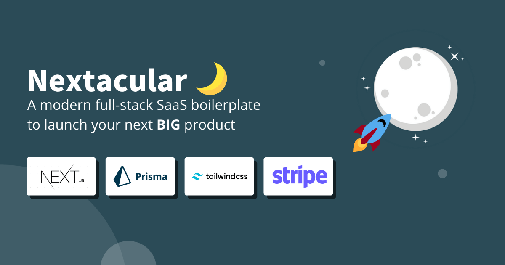

# Nextacular🌙

    

## Quickly launch multi-tenant SaaS applications

An open-source starter kit that will help you build full-stack multi-tenant SaaS platforms efficiently and help you focus on developing your core SaaS features. Built on top of popular and modern technologies such as Next JS, Tailwind, and Prisma

**Features** packaged out-of-the-box: **Authentication**, **Billing & Payment**, **Database**, **Email**, **Custom Domains**, **Multi-tenancy**, **Workspaces**, and **Teams**

## Live Demo

Nextacular Demo: [https://demo.nextacular.co](https://demo.nextacular.co)

## Documentation

Nextacular Documentation: [https://docs.nextacular.co](https://docs.nextacular.co)

## Getting Started

Read the quick start here: [https://docs.nextacular.co/getting-started/quick-start](https://docs.nextacular.co/getting-started/quick-start)

## Deploy to Netlify 🚀

Deploy to Netlify for free!

After deployment, set the required [Environment Variables](https://docs.nextacular.co/customization/environment-variables) in your Netlify dashboard.

Read the [docs](https://docs.nextacular.co) for more details

## Outstanding Features

- 🔐 Authentication
- 💿 Database Integration + Prisma (SQL/PostgreSQL)
- 🤝 Teams & Workspaces
- ☁ Multi-tenancy Approach
- 📜 Landing Page
- 💸 Billing & Subscription
- 📱 Simple Design Components & Mobile-ready
- 🔍 SEO Support
- 👾 Developer Experience
- 💌 Email Handling

## Tech Stack

### Primary

- [Next.JS](https://nextjs.org) - **13.1.0** (React **18.2.0**)
- [Tailwind CSS](https://tailwindcss.com) - **3.1.8**
- [Prisma](https://prisma.io) - **4.4.0**
  

## Dependencies

- Headless UI - 1.7.7
- Hero Icons - 2.0.12
- Date FNS - 2.29.3
- Express Validator - 6.14.2
- Micro - 9.4.1
- Next Themes - 0.2.1
- Nodemailer - 6.8.0
- React Copy to Clipboard - 5.1.0
- React Google Analytics - 3.3.1
- React Hot Toast - 2.4.0
- React Top Bar Progress Indicator - 4.1.1
- Slugify - 1.6.5
- Stripe - 10.13.0
- SWR - 1.3.0
- Validator - 13.7.0

## Built With Nextacular

Check out these amazing projects built with Nextacular:

1. [Nextacular Demo](https://demo.nextacular.co) by Nextacular
2. [Livebic](https://livebic.com/) by Shadrach
3. [Vixion Pro Blogging](https://vixion.pro) by Mina
4. [Living Pupil Homeschool Solutions](https://livingpupilhomeschool.com) by Living Pupil
5. [MyWS](https://myws.dev) by Ruyi (@monoxruyi/@ruyi12)
6. [Trippr AI](https://ai.trippr.travel) by Trippr Tech Inc.
7. [BuzzBonus](https://buzzbonus.tech) by Ram (@rapturt9)
8. [MediumFox](https://mediumfox.com) by CSK (@medfox_73823)

> If you have a project built with Nextacular and want to be listed, feel free to reach out to us through our Discord server.

## Reviews

> Steven Tey - Developer, Vercel
> It's going to be super helpful for folks to bootstrap their MVPs and get to market faster!
>
> **Positive company mission**, **Easy to use**, **Cost-effective**, **Strong feature set**

## Company Sponsors

## Vercel

### GitBook - Documentation Sponsor

Your company name could be here. If you wish to be listed as a sponsor, reach out to [teamnextacular@gmail.com](mailto:teamnextacular.com)

## Contributing

Want to support this project?

1. Consider purchasing from our marketplace (soon)
2. Subscribe to our newsletter. We send out tips and tools for you to try out while building your SaaS
3. If you represent company, consider becoming a recurring sponsor for this repository
4. Submit issues and features. Fork the project. Give it some stars. Join the discussion
5. Share Nextacular with your network

> Read the [guidelines](CONTRIBUTING.md) for contributing

## License

All code in this repository is provided under the [MIT License](LICENSE)

## Supporters – Special Mention 🎉 Thank you!

Show some love and support, and be a backer of our project

Kaur Kirikall ([@KaurKirikall](https://twitter.com/KaurKirikall)), Brian Roach, Cien Lim, Chris Moutsos, Fred Guth ([@fredguth](https://twitter.com/fredguth)), Maxence Rose ([@pirmax](https://twitter.com/pirmax)) Sandeep Kumar ([@deepsand](https://twitter.com/deepsand)), Justin Harr ([@DasBeasto](https://twitter.com/dasbeasto)), Saket Tawde ([@SaketCodes](https://twitter.com/SaketCodes)), Corey Kellgren, Adarsh Tadimari, Altamir Meister, Abhi Ksinha

## Acknowledgement

🙏 Happy to have the support of early adopters and supporters over at [Product Hunt](https://www.producthunt.com/posts/nextacular), [Gumroad](https://arjayosma.gumroad.com/l/nextacular), [Github](https://github.com/nextacular/nextacular), [Twitter](https://twitter.com/nextacular), and through personal email. Lots of plans moving forward. Thanks to you guys!
